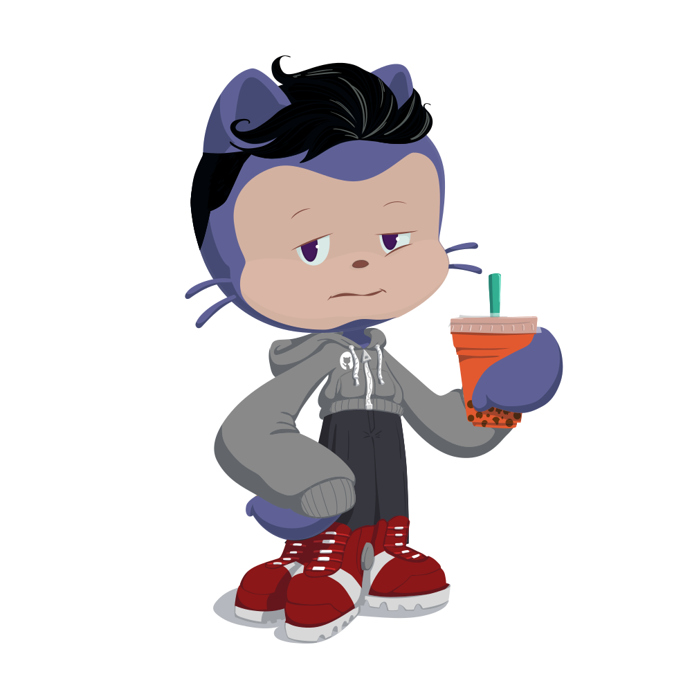
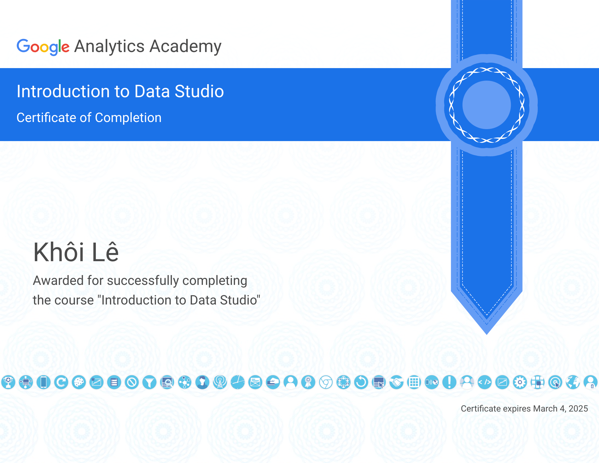
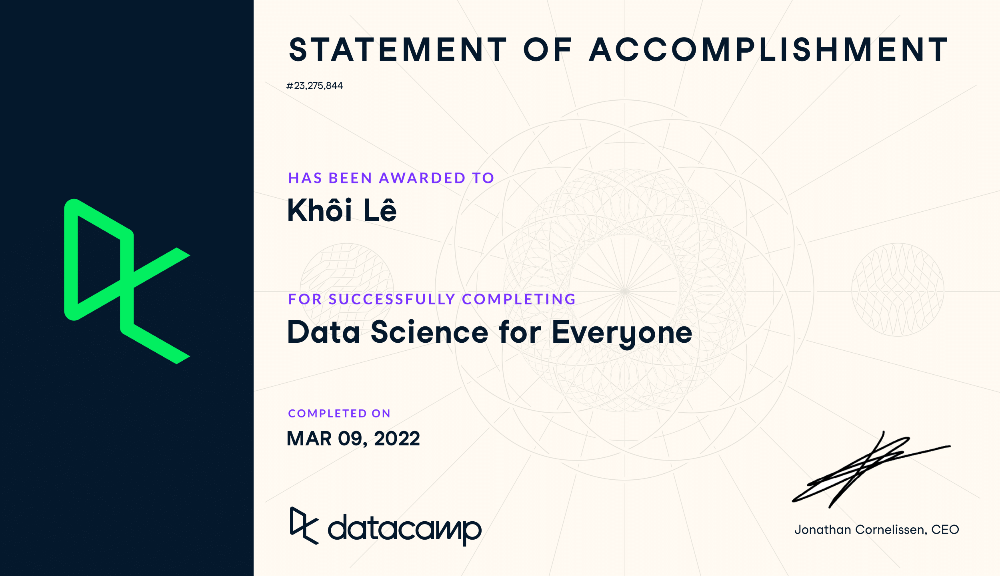
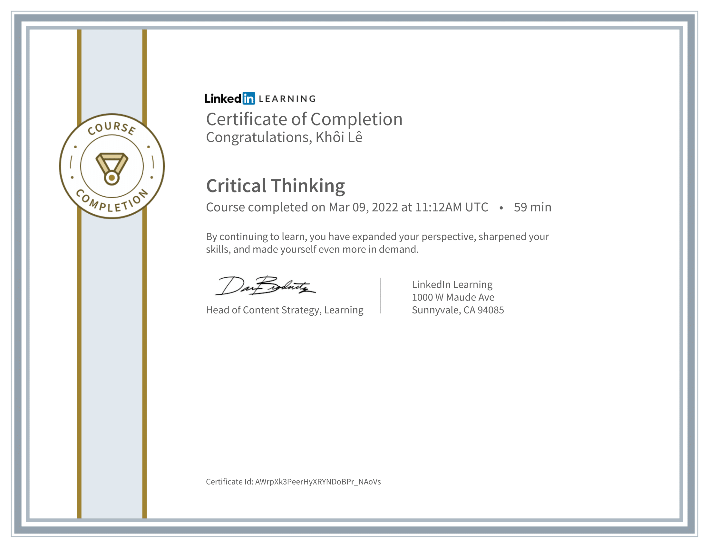

# 

## 📡 Feel free to contact me

You can get in touch with me in either of the following ways:

    
     
    
    

## 👨‍💻 My career path

I am now an undergraduate student at [Ton Duc Thang University](<https://www.tdtu.edu.vn/en>), where I am majoring in **Software Engineering**.

In the future, I hope to work as a **data engineer**. Furthermore, I aspire to be a **data scientist**.
I am really interested in data science and am continuously searching for new methods to improve my abilities.

My resumes are available [here](https://drive.google.com/drive/folders/15ClLE11WMxZeqjlt8Q5hPzH6ZznrRs21?usp=sharing).

## 🏅 Certificates I have archived

My very first certificate is from **Google Analytics - Introduction to Data Studio**, I have got this certificate in March 2022. During that month, I obtained two more credentials from **DataCamp** and **LinkedIn**.

The following is a list of all of the certifications that I have earned.

## 🤓 I've learned these technologies since my first line of code

**Python** and **SQL** are two languages that I am familiar with, along with various ***Python packages*** I can implement. I also know how to write code in *Java*, *HTML*, *CSS*, *Javascript*, and *PHP*.

<table>
    <thead>
        <tr>
            <th colspan=2>Things that I've internalized</th>
        </tr>
    </thead>
    <tbody>
        <tr>
            <td>Languages</td>
            <td>
                
                
                
                
                
                
                
            </td>
        </tr>
        <tr>
            <td>SQL</td>
            <td>
                
                
            </td>
        </tr>
        <tr>
            <td>Machine Learning/Deep Learning libraries</td>
            <td>
                
                
                
                
                
            </td>
        </tr>
        <tr>
            <td>Additional libraries</td>
            <td>
                
                
                
            </td>
        </tr>
        <tr>
            <td>Operating systems</td>
            <td>
                
                
                
            </td>
        </tr>
    </tbody>
</table>

## 🗂️ My personal projects

I've worked on *Machine Learning*, *Data Crawling*, *Natural Language Processing*, and *Data Visualization* projects in the past, you can take a look at my [repositories](https://github.com/khoilr?tab=repositories).

The top five projects that I am most enthusiastic about are as follows:

## 😻 What I typically do in my spare time

In my leisure time, I frequently **spend it on social media platforms** such as Facebook or Tiktok (I intend to become a Tiktok content creator 😆).

**Watching movies** is one of my hobbies. Some of my **favorite** films include:

- *The Walking Dead*
- *Stranger Things*
- *Money Heists*
- *Lupin*
- *The Marvel Cinematic Universe*
- *The DC Universe*
- etc.

I also **watch a little anime** (I'm not a really big fan of anime), those are:

- *Naruto*
- *Demons Slayer*
- *Attack on Titan*

Aside from Facebook and Tiktok, **exploring GitHub repositories** to learn and contribute to the development of my own projects is really an excellent option.

Nothing surpasses coding and **listening to music** at the same time. Try [my Spotify playlist](https://open.spotify.com/playlist/5uJtaafEanWoz5ObTyE5q2?si=b17ef27abb5d4071) to discover if our musical tastes are similar.

I was encouraged from a young age to always do well in school, therefore I have a strong interest in **studying and reading**

- *The Alchemist* by Paulo Coelho
- *The Legendary Series* by Marie Lu
- *The Call of the Wild* by Jack London
- *The Hundred-Year-Old Man Who Climbed Out the Window and Disappeared* by Jonas Jonasson

...are some of the novels I've read 📖.

And finally, **cats, lots of cats.**

## 🏆 My GitHub trophies

## 📊 Get more insight into my coding activities

 

 

