# 

## 📡 Reach Me

You can get in touch with me in either of the following ways:

  

My resumes are available [here](https://drive.google.com/drive/folders/15ClLE11WMxZeqjlt8Q5hPzH6ZznrRs21?usp=sharing).

## 👨‍💻 Career Path

I am now an undergraduate student at [Ton Duc Thang University](<https://www.tdtu.edu.vn/en>), where I am majoring in Software Engineering.

In the future, I hope to work as a **data engineer**. Furthermore, I aspire to be a **data scientist**.
I am really interested in data science and am continuously searching for new methods to better my abilities.

## 🏅 Certificates

My very first certificate is from Google Analytics - Introduction to Data Studio. I have got this certificate from in March 2022.

[

](https://analytics.google.com/analytics/academy/certificate/5MebS9poTdyDvK8_tJmgEQ)

## 🗂️ Projects

**Python** and **SQL** are two languages that I am familiar with. I also know how to write code in *Java*, *HTML*, *CSS*, *Javascript*, and *PHP*.

I've worked on *Machine Learning*, *Data Crawling*, *Natural Language Processing*, and *Data Visualization* projects in the past, you can take a look at my [repositories](https://github.com/khoilr?tab=repositories).

The top five projects that I am most enthusiastic about are as follows:

    

## 📊 Activity Statistics

### Stack Overflow stats

### GitHub stats

 

### Metrics

## 😻 Interests

Watching movies 🎬 is my favorite hobby. Some films I like are: *The Walking Dead*, *Stranger Things*, *Money Heists*, *Lupin*, *The Marvel Cinematic Universe*, and *The DC Universe*, etc. I also watch a little bit of anime (I'm not a big fan of anime), those are: *Naruto*, *Demons Slayer*, and *Attack on Titan*.

I also love listening to music. Try [my Spotify playlist](https://open.spotify.com/playlist/5uJtaafEanWoz5ObTyE5q2?si=b17ef27abb5d4071) to discover if our musical tastes are similar.

I was encouraged from a young age to always do well in school, therefore I have a strong interest in studying and reading. *The Alchemist* by Paulo Coelho, *The Legendary Series* by Marie Lu, *The Call of the Wild* by Jack London, and *The Hundred-Year-Old Man Who Climbed Out the Window and Disappeared* by Jonas Jonasson are some of the novels I've read 📖.

And finally, cats, lots of cats.

---

> 😘 Thank you for visiting my GitHub profile
